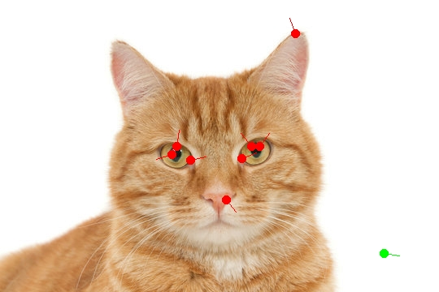
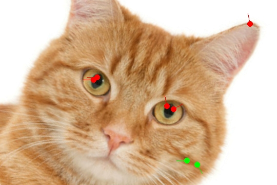

# Structure from Motion: Images/Video to 3D Model Converter

## SIFT algorithm for keypoint detection from different perspectives (CUDA Accelerated)

| Perspective 1 | Perspective 2 |
|---------------|---------------|
|  |  |

As you can see, the algorithm can detect the cat's key features and can be used to calculate the cat's position based on two images.

## Prerequisites
- Docker installed on your system

## Build and Run

1. Build the Docker image:
   ```powershell
   docker build -t fastcv .
   ```
2. Run the container:
   ```powershell
   docker run --gpus all --rm -v ${PWD}/resources/test_images:/app/resources/test_images fastcv
   ```


## Tasks:
   - Rewrite int Sift::findDoGKeypoints:
      - Pass dog as multidimensional array, not pointer, to remove dog_curr, dog_prev, dog_next
      - Improve readability
   - Implement building 3D models from keypoints
